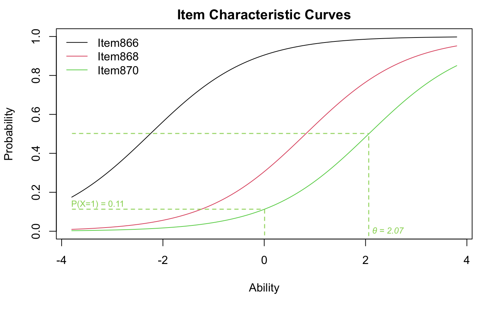
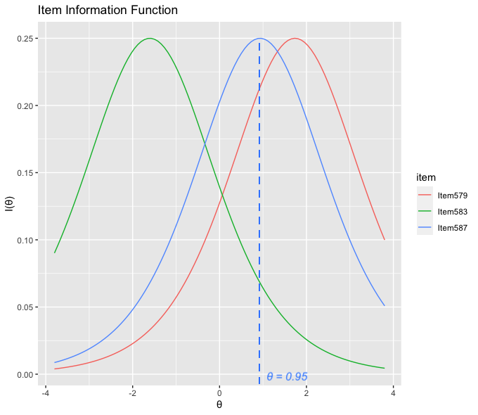
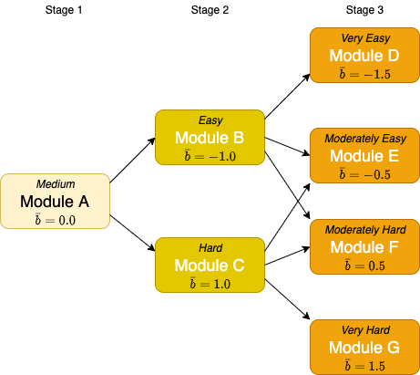
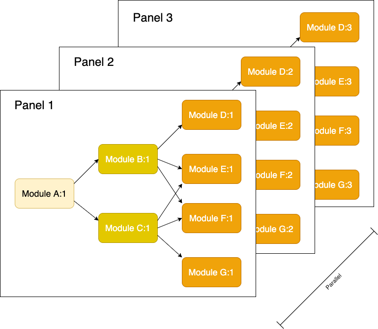
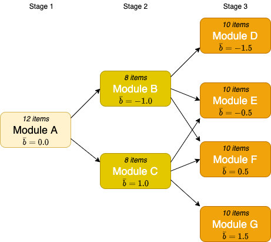
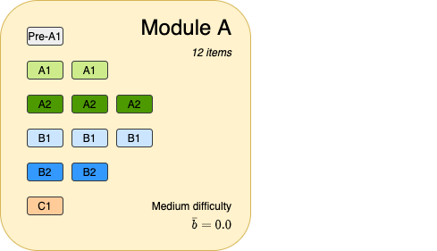
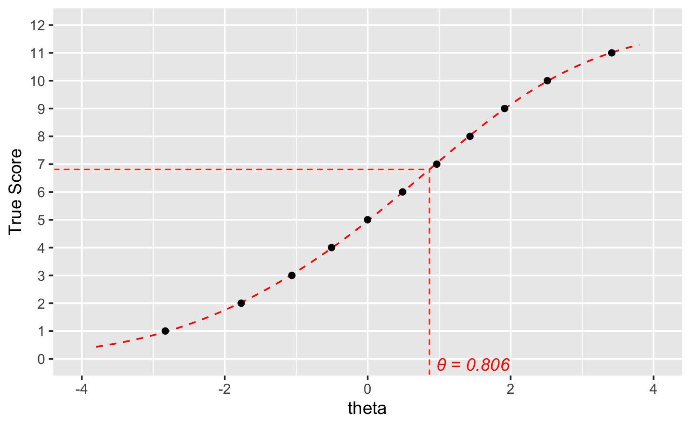

```{r setup, include=FALSE}
library(knitr)
library(tidyverse)

library(mstR)
library(ltm)

options(scipen = 1, digits = 3)
```

# Overview

Computerised multistage tests (MSTs) have grown in popularity in recent years due to their advantages of flexibility and simplicity over linear and computerised adaptive tests (CATs). A growing body of academic literature is available for researchers, however the practicalities of using MST for the design and delivery of real-world tests is still difficult to access. I hope this article provides a useful practical guide to test design and delivery.

This article is split into 3 main parts:
1.	The design of MSTs
2.	The development of MSTs
3.	The validation of MSTs
  a.	Test construction
  b.	Trialling
  c.	Scoring and routing 

In this article we’ll consider an example *item* which will follow a lifecycle from when it is first conceived, developed, rated and trialled, banked in the item bank, delivered as part of one or more test administrations, and finally retired from use. We will also consider a hypothetical *candidate* and follow their *journey* from being entered to take the test, being routed between the different stages of the test, and receiving a final score and report on their results.

# The Design of MSTs

The advantages of splitting tests up into units of items called *modules* and directing candidates to these modules based on their latent ability estimates provides a more efficient test delivery than a corresponding linear test, whilst also offering an easier method of assembly, and greater protection against test copying.

We'll assume some familiarity with Item Response Theory (IRT) - and the Rasch model. Some knowledge of programming with R would be useful to understand the examples given. For background information and primers on these subjects we provide references.

The main focus is the development of tests for language learners, specifically English language learners. The theory and data processing involved can  be transferred to other domains that require measurement of latent ability. The IRT model that we focus on is the 1PL (or Rasch) model. For readers interested in extending analysis to more complex models, see @magis2017computerized.

Developing a new test is a complex, multi-disciplinary task, involving content experts, specialist item writers, psychometricians, software engineers, validation experts and project managers. It is essential, before beginning any of this work to have a clear vision of what you are seeking to test, and the types of candidates that you will be targeting along with their needs. The main tasks when developing a new test will include:

* Blueprint, test specification and test design
* Simulation
* Item writing
* Item review and rating
* Pilot/Live trial
* Rasch modelling and item banking
* Establishing cut scores and scale scores
* Live test

Once the live test has been launched, continual monitoring and adjustment of the test will be essential to ensure that it remains secure and delivers on the targeted goals over the long term.

## Constraints and Assumptions

This article focuses on practical solutions to problems that may be encountered during a test design. Lack of sufficient data, particularly in the early stages of design, is a perennial problem. The ability to validate the design at an early stage with simulated data is therefore important and will be covered here.

In addition, the test delivery system may be restricted in its ability to access the item bank to derive item difficulties. In this case, mapping functions to derive ability estimates and scale scores as well as provision of the cut scores for module routing must be provided in advance of test administration for each panel. We demonstrate methods that can be used to provide these values.

## Introduction to Item Response Theory

When you deliver a test to a set of candidates, how can you be sure that you are measuring those candidates in the same way, even though the test administrated to one candidate has different items from that administered to another candidate?

The underlying theoretical basis for MST is the branch of psychometrics known as Item Response Theory, or IRT. The theory proposes that there are *latent traits* (for example language ability) that can be measured using a set of items delivered to the test candidate. These test items are typically scored as correct (1) or incorrect (0) - and it is these dichotomous item types that we focus on here. It is also possible to offer polytomous item types (for example based on Likert scales, or partial credit items), but we won't cover those in this article.

The responses to the test items can then be used to estimate the candidate's latent ability. This can be done by first fitting an IRT model to a response dataset collected during the trial phase. This model can then be used to make predictions about latent ability based on item responses once the test goes live. The latent ability estimates can then be converted into a scale score, an ability summary, or both. The rest of this document provides practical examples of designing a multistage test, fitting an IRT model and calculating scores.

MSTs differ from linear and CATs in that the test items are grouped into modules that can be delivered as separate but linked units as part of a test administration. Progression from module to module is dictated by the candidate's estimated ability, with cut-scores determining the next module to progress to.

### The Rasch Model

The simplest IRT model, the so-called *Rasch model*, applies logistic regression to items, using responses from a set of trial candidates. If you're familiar with linear regression, then the idea behind logistic regression is that the model fits a probability range (between 0.0 and 1.0) rather than a dependent variable. The independent variables are the difficulty of the item (usually designated as $b$), and the latent ability (which is denoted $\theta$). Because it only factors in the difficulty parameter of the item, it is also known as the one-parameter logistic model (1PL). Here's the *item response function* (IRF) that is used to model the probability of a correct response for candidate $i$ taking test item $j$:

$$
Pr(X_{ij} = 1|\theta_{i},b_{j}) = \frac{exp(\theta_{i} - b_{j})}{1+exp(\theta_{i} - b_{j})}
$$
$Pr(X_{ij} = 1)$ is the probability of a correct response, $\theta_i$ represents the latent ability of the candidate being measured, and $b_j$ represents the difficulty of item $j$. Certain assumptions are made by the model, most importantly:

* Each item targets one and only one latent trait
* The items are independent of one another
* The response probability increases with the ability level using the item response function described above

### Item Difficulty and the Item Characteristic Curve

For every item, the probability that the item will be answered correctly can be visualised by plotting an Item Characteristic Curve (ICC), which uses the above logistic function. Figure 1 plots the ICCs for three items: Item579 (red), Item583 (green) and Item587 (blue).



There is an equivalence between $\theta$ and $b$. In this example a candidate with mean ability ($\theta = 0$) would be expected to get item 587 (blue) correct with a probability of 0.28. The same candidate would have a a probability of 0.83 of getting the less difficult item 583 (green) correct. The further to the right the sigmoid is the more difficult the item is, with item 868 (red) being the most difficult of the three.

The slope of the curve indicates how discriminating the item is. An item that is very discriminating will have a steep curve; one that is less discriminating will have a flatter curve. Highly discriminating items have more measurement information. Ideally you want to have many discriminating items to be able to provide a lower error in your ability estimate. In general, the more items you are able to trial with, the more information (and less error) you will have.

### Item Discrimination and the Item Information Function

An item that all candidates always get right because it is too easy, or they always get wrong because it's too hard has very little informational value for a test. It's telling you very little about the ability levels of your candidates. From this it follows that an item where half the candidates answer correct and the other half answer wrong has the most informational value; this is the point where $\theta$ and $b$ are equal, so the item is perfectly targeted at the ability of these candidates. This relationship can be expressed by the Item Information Function (IIF). In the 1PL model the maximum value of the IIF is 0.25 (it can be different in the other models due to the influence of the discrimination parameter $a$).  Figure 2 displays the IIFs for the same three items as before.



The information function is expressed as:

$$
I_i(\theta, b_i) = P_i(\theta, b_i)Q_i(\theta, b_i)
$$
Where P is the probability of getting the item correct (for a given ability), and Q is the probability of getting it wrong.

As mentioned, greater information implies a smaller error of measurement. When designing a test it is important to deliver items with a range of difficulties that match the expected ability ranges of the candidates so that you can accurately measure the your target candidates. In the above diagram you can see that Item 587 (blue) is good at measuring candidates around ability level 0.95. Item (green) 583 is better at measuring candidates with a lower ability level.

### Logits

The log odds, or *logit* of a correct response can be expressed (in the Rasch model) as $\theta - b$; so if a candidate has ability $\theta$ which happens to be equal to the difficulty of our item $b_{583}$, then the odds are even (1:1) that they will answer it correctly (in other words a 50% chance of getting it right, and a 50% chance of getting it wrong). The logit value here would be 0 (remember this is also the point of maximum information for the item). The logit function is the inverse of the logistic function described earlier:

$$
logit(p) = log(\frac{p}{1-p})
$$
Where $p$ is a probability.

### Test Item Lifecycle

The item response function is a logistic function with a characteristic sigmoid (or 'S' shape), and can be plotted for each item. Throughout the rest of this article we'll consider an example item, **Item583**, which will follow a *lifecycle* from when it is first conceived, developed, rated and trialled, banked in the item bank, then delivered as part of one or more test administrations, and finally retired from use.

Of course, this item is just one of many that will, over time, be added into an item bank. The item will have a number of properties and metadata that describes it. For example the name of the item writer who created it, the skill it is targeting, the sub-skills required, a set of media (audio, video or image files) that is associated with it and which serve as stimuli, the instructions, the prompt question, and importantly for our purposes, the difficulty coefficient $b$. The rest of this article follows this life cycle, in particular how it relates to the various IRT methodologies for design and validation of multistage tests.

# Blueprint and test specification

When designing any test, it is important to ensure that items are written to the target ability range that you want to measure. Subject Matter Experts (SMEs) will need to be involved in the initial test design to make decisions about the length of the test and the components (skills as R,L,S,W, or any combination of these) for the target candidature.

In a multistage test, modules need to be constructed in such a way that they target a specified ability range. We'll see later on how a Module Information Function can be used to help with module routing decisions. Also, routing needs to be designed with overlapping items between adjacent modules.

## IRT for Mulitstage Test Design

IRT is used to inform calibration of the test items after they've been developed by item writers, as well as construction of the modules and routing between them. Scoring of the test can be derived from the ability estimates. Typically the initial module (known as the routing module) will have an overall difficulty of 0 (ie. a mix of easy and hard items), with subsequent routing directing candidates to easier or more difficult modules in order to 'hone in' on an accurate $\hat{theta}$ (ability estimate) at the end of the test.

A typical modular design for a MST will look like this (Figure 3):



This is an example of a 1-2-4 design, but others are possible. Important questions to answer during test design are what module topology to use (the number of stages and modules per stage), and what should be the overall difficulty levels for each module (represented as the mean item difficulty, $\bar{b}$).

## MST Design Considerations

As mentioned earlier, multistage test designs comprise a number of modules arranged into stages. The question then becomes, how many stages do we need, and how many modules in each stage do we want? We saw earlier an example of a simple 1-2-4 design.

This design may not be sufficient for your needs. You need to consider whether there are groups of items that naturally fit into a particular stage (for example, separating reading or listening tasks into separate stages). You also need to consider how many items per stage you want to have. Also, in order for the routing between modules to produce acceptable results, you need to consider the relative difficulty of each module.

Normally the so-called routing module in stage 1 (Module A) would contain a mix of items with a mean difficulty of 0 (in other words ‘medium’ difficulty). Candidates that are placed in the lower ability range at the end of this module will be routed to the ‘easy’ module in stage 2 (Module B), and those in the upper ability range to the ‘hard’ module (Module C).

## Panels

A benefit of using modules is that items can be placed into modules and then delivered as parallel test forms called *panels*. Having multiple panels helps to reduce item exposure rate as previously seen panels can be precluded from selection for future test administrations. It also makes it easier to assemble tests. It is possible to place items in more than one panel, but its important to ensure that parallel panels are of equivalent difficulty, see Figure 4.



When constructed in this way each module can be considered as a module instance (for example Module D:3 being the instance of module D in panel 3), Once the test topology has been decided, the first panel can be developed a prototype.

# The Development of MSTs

In this part we describe the steps needed in the development of MSTs. Here we turn our attention to initial validation to confirm the soundness of the test design that was conceived at the first stage of test development described in Part 1 of this article.

## Simulation

In the pre-trial stage, it is advisable to run simulations to help us answer questions raised in Part 1 of this article, and inform final decisions about test design. It's always less expensive to make modifications to a design early on in the process, before significant investment in item writing and trialling has been made. The ability to simulate a test at the design phase can be used to understand the constraints of the design at an early stage and make changes in a low-cost, low-risk way. In this section we'll show how the `mstR` R package can be used to run simulations for a MST design. First we'll discuss the data sources that we'll be using.

## Data Sources and Management

In order to perform a simulated test, there are a number of different data sources that are required.

The first class of these data sources is the one that is used to store item information. The key entities to store here:

* Items
* Modules
* Panels

In addition to the item information, another data source is used for the candidate information. This forms the candidate information system (CIS) that will be used for the test. In addition to storing a unique candidate ID, additional metadata of interest, such as the candidate's length of study or first language (L1), may be held by the CIS.

Finally, test response data is required. Essentially this is a matrix containing rows of candidates and columns of items. Cells will contain a 1 (item answered correctly) or a 0 (item answered incorrectly). Items that were not presented (for example, from a module that was not in the test path for a candidate) are left blank and will be classed as NA.

This data may be stored as flat files (in CSV format for instance), or held in database tables, or in a mix of different sources. Typically you would want to keep them in a cloud storage system (for example in AWS S3 buckets or an RDS database) to ensure that the data is stored in a way that is secure, accessible and geographically distributed for resilience.

## Pre-Trial Simulation and Design

An initial simulation of your test to experiment with different designs can be done by using the `mstR` library (see @magis2017computerized). Here the aim is to select a set of designs and see if there is an optimal design. It will also help understand how the scoring of the test should be implemented, including the number correct (NC) scores that will be used for routing, and the ability estimates for final scoring and reporting.

The `mstR` library can take an existing set of item responses, or you can use it to generate a set of randomised simulated item responses. This latter ability is useful in the pre-trial stage where we're interested in finding out how routing between modules should be established, or to validate assumptions in the test design.

The aim here is to sift several different test designs; and re-run simulations easily.

### Module Setup

With `mstR` it is possible to define:

* the module topology (number of stages and modules per stage)
* the number of items per module and the average module difficulty
* the IRT model to use

Assuming the 1-2-4 pattern shown above, with a total of 30 items (12 + 8 + 10), a simulation for the test design can be created from following elements:

* a simulated item bank
* the modules and the items they contain
* the routing rules in the transition matrix

Average difficulty levels for each module are shown in Figure 5 below (where $\bar{b}$ is the mean difficulty of the module, and a standard deviation of 1 is assumed)



#### The Simulated Item Bank

Here we create a set of items `it.MST` using difficulties from a normal distribution:

```{r module difficulties, echo=TRUE}
it.MST <- rbind(genDichoMatrix(12, model = "1PL", bPrior = c("norm", 0.0, 1)),
	genDichoMatrix(8, model = "1PL", bPrior = c("norm", -1.0, 1)),
	genDichoMatrix(8, model = "1PL", bPrior = c("norm", 1.0, 1)),
	genDichoMatrix(10, model = "1PL", bPrior = c("norm", -1.5, 1)),
	genDichoMatrix(10, model = "1PL", bPrior = c("norm", -0.5, 1)),
	genDichoMatrix(10, model = "1PL", bPrior = c("norm", 0.5, 1)),
	genDichoMatrix(10, model = "1PL", bPrior = c("norm", 1.5, 1)))
it.MST <- as.matrix(it.MST)
```

Here we've decided to use the 1PL (or Rasch) model, so we need to supply `bPrior` difficulty distributions, and convert the data frame into a matrix. The `bPrior` parameter is constructed using a normal distribution with a given $\bar{b}$ and standard deviation of 1.
We'll end up with a matrix of 68 items, each with randomised difficulty parameters.

#### Assigning Items to Modules

Selecting items into the modules is done by creating another matrix with 68 rows (items) and 7 columns (modules); a cell containing a 1 indicates membership of an item in a module. Because we're using an R matrix to store this information we must use the index of the module (module A == 1, module B == 2, and so on); the code snippet below uses a helper function called `module()` to map from names to indices.

```{r module items, echo=TRUE}
# create a function to map module names to indices
moduleIndices <- seq(1:7)
moduleNames <- c('A', 'B', 'C', 'D', 'E', 'F', 'G')
names(moduleIndices) <- moduleNames
module <- function(n) { unname(moduleIndices[n]) }

modules <- matrix(0, 68, 7)
modules[1:12, module('A')] <- 1
modules[13:20, module('B')] <- 1
modules[21:28, module('C')] <- 1
modules[29:38, module('D')] <- 1
modules[39:48, module('E')] <- 1
modules[49:58, module('F')] <- 1
modules[59:68, module('G')] <- 1
```

#### Module Routing

The final part of the design activity is construction of the routing paths and cut-offs used for next module selection. This is done by creating an $R \times R$ *transition matrix* which shows the valid paths to modules in the next stage (where $R$ is the number of modules). A value of 1 in the `routing` matrix in the code sample below indicates that a path exists from module $i$ to module $j$. To use the example below the rule `routing[module('A'), module('B'):module('C')] <- 1` means module A routes to modules B and C.

In addition to the routing paths, a set of cut-off criteria must be given. These are expressed in terms of $\hat{theta}$ using the `cutoff` matrix. To use an example here, the rule `cutoff[module('B'),] <- c(-Inf, 0.0)` means that candidates with ability estimates from minus infinity to zero will be routed to module B. The rule `cutoff[module('C'),] <- c(0.0, Inf)` means that candidates with ability estimates from zero to plus infinity will be routed to module C.

```{r module routing, echo=TRUE}
routing <- matrix(0, 7, 7)
routing[module('A'), module('B'):module('C')] <- 1
routing[module('B'), module('D'):module('F')] <- 1
routing[module('C'), module('E'):module('G')] <- 1

cutoff <- matrix(NA, 7, 2)
cutoff[module('B'),] <- c(-Inf, 0.0)
cutoff[module('C'),] <- c(0.0, Inf)
cutoff[module('D'),] <- c(-Inf, -1.0)
cutoff[module('E'),] <- c(-1.0, 0.0)
cutoff[module('F'),] <- c(0.0, 1.0)
cutoff[module('G'),] <- c(1.0, Inf)

(cutoff)
```

As can be seen, module D to module G are final stage modules, so do not route onward.

### Test Simulation

Having created a simulated item bank for the design, it is possible to generate simulated item responses by selecting a $\theta$ for a simulated candidate and running the `genPattern()` function to return a set of simulated item responses:

```{r simulated test response, echo=TRUE}
theta <- 0.95

dfSampleResponse <- genPattern(theta, it.MST)

(dfSampleResponse)
```

Here we use a $\theta$ of `r theta` for our hypothetical candidate as an example. Note that this doesn't really simulate a true MST test, as it ignores the routing rules and simply returns a response for all items in the simulated item bank. We can however use the `randomMST()` function to perform a more realistic simulation. The `randomMST()` function will generate a response pattern for a given simulated item bank, an MST structure, and a true ability level ($\theta$). We'll use Bayesian model estimation (`"BM"`) for ability estimation (this is the default ability estimation method for the `mstR` library). The maximum Fisher information criterion (`"MFI"`) for is used for module selection; again this is the default. The Fisher information is the measure of the amount of information that item $X$ carries about the unknown ability parameter $\theta$.

```{r simulated MST test response, echo=TRUE}
start <- list(theta = theta)
test <- list(method = "BM", moduleSelect = "MFI")
final <- list(method = "BM")

dfMSTResponse <- randomMST(trueTheta = theta, 
                           itemBank = it.MST, 
                           modules = modules, transMatrix = routing,
                           start = start, test = test, final = final)

(dfMSTResponse)
```

For this simulated candidate with a true $\theta$ = `r dfMSTResponse$trueTheta`, the estimated ability $\hat{\theta}$ = `r dfMSTResponse$thFinal`. 

The Module Information Function is used to determine the 'best' (that is the most informative) module to route to in the next stage. In this case the modules that the candidate was routed to were `r names(moduleIndices[dfMSTResponse$selected.modules])`. A plot can be made as follows, showing the highlighted route through the multi-stage test. Note that the output from the `randomMST` function and the plot use the module and item indices (rather than their labels), so you may want to map these back to a name for ease of interpretation.

```{r show simulated test, echo=FALSE}
plot(dfMSTResponse)
```

### Running Repeated Simulations

We can run repeated simulations varying the topology of the test (for example changing number of stages and modules). Or by changing the number of items per module, the mean difficulty levels, or some other aspect of the model. By calculating the differences between estimated and true ability levels we can see which set of test features is optimal.

In this example we'll change the number of items per module; keeping the total number of items administered constant, but changing the relative number of items as follows:

| Design | Stage 1 | Stage 2 | Stage 3 | Total |
| ------ | ------: | ------: | ------: | ----: |
| 1      | 12      | 8       | 10      | 30    |
| 2      | 12      | 10      | 8       | 30    |
| 3      | 10      | 12      | 8       | 30    |
| 4      | 10      | 8       | 12      | 30    |
| 5      | 8       | 10      | 12      | 30    |
| 6      | 8       | 12      | 10      | 30    |

We define the `mstDesign()` function to generate the set of test designs we want to investigate. This function varies the number of items for each module by stage and can be repeatedly applied to the set of designs in the `stages` list. It effectively generates variants of the test design presented above in \@ref(module difficulties) for 3-stage designs.

```{r MST designs}
mstDesign <- function(stage, difficulties) {
  matrixN <- stage[1] + (2 * stage[2]) + (4 * stage[3])
  modules <- matrix(0, matrixN, 7)
  moduleA <- stage[1]
  moduleB <- moduleA+stage[2]
  moduleC <- moduleB+stage[2]
  moduleD <- moduleC+stage[3]
  moduleE <- moduleD+stage[3]
  moduleF <- moduleE+stage[3]
  moduleG <- moduleF+stage[3]
  
  modules[1:moduleA, 1] <- 1
  modules[moduleA+1:stage[2], 2] <- 1
  modules[moduleB+1:stage[2], 3] <- 1
  modules[moduleC+1:stage[3], 4] <- 1  
  modules[moduleD+1:stage[3], 5] <- 1
  modules[moduleE+1:stage[3], 6] <- 1
  modules[moduleF+1:stage[3], 7] <- 1
  
  itembank <- rbind(genDichoMatrix(stage[1], model = "1PL", bPrior = c("norm", 0.0, 1)),
                    genDichoMatrix(stage[2], model = "1PL", bPrior = c("norm", -2.0, 1)),
                    genDichoMatrix(stage[2], model = "1PL", bPrior = c("norm", 2.0, 1)),
                    genDichoMatrix(stage[3], model = "1PL", bPrior = c("norm", -3.0, 1)),
                    genDichoMatrix(stage[3], model = "1PL", bPrior = c("norm", -1.0, 1)),
                    genDichoMatrix(stage[3], model = "1PL", bPrior = c("norm", 1.0, 1)),
                    genDichoMatrix(stage[3], model = "1PL", bPrior = c("norm", 3.0, 1)))
  itembank <- as.matrix(itembank)

  return(list("modules" = modules, "itemBank" = itembank))
}

stages <- list(c(12,8,10), c(12,10,8), c(10,12,8),
               c(10,8,12), c(8,10,12), c(8,12,10))
testDesigns <- lapply(stages, mstDesign)
```

To run the simulations we'll create a set of simulated candidates with ability range -4 to 4 (stepped in increments of 0.5). Then we'll repeat for each of the six designs above, with the same item bank.

```{r setup simulation}
simulation.levels <- seq(-4, 4, 0.5)
simulation.candidates <- rep(simulation.levels, each = 450)
simulation.responses <- matrix(NA, length(simulation.candidates), 6)
simulation.start <- list(theta = 0)
simulation.test <- list(method = "BM", moduleSelect = "MFI")
simulation.final <- list(method = "BM")
```

We'll then loop over each design, running the `randomMST()` function to simulate a test.

```{r simulate tests}
for (j in 1:6) {
  for (i in 1:length(simulation.candidates)) {
    prov <- randomMST(trueTheta = simulation.candidates[i],
      itemBank = testDesigns[[j]]$itemBank, modules = testDesigns[[j]]$modules,
      transMatrix = routing, genSeed = i,
      start = simulation.start, test = simulation.test, final = simulation.final)
    simulation.responses[i,j] <- prov$thFinal
  }
}
```

#### ASB and RMSE values

The results can now be graphed. Following @ippel2020efficient and @magis2017computerized we compute the averaged signed bias (ASB) and root mean squared error (RMSE) values for each design and for each ability level. ASB is the mean difference between estimated and true ability levels. RMSE is the square root of the mean of the squared differences between estimated and true ability levels. With both measures, lower is better.

```{r simulation results}
simulation.ASB <- simulation.RMSE <- matrix(NA, length(simulation.levels), 6)
ASB <- function(t, th) mean(t-th)
RMSE <- function(t, th) sqrt(mean((t-th)^2))

for (i in 1:length(simulation.levels)) {
  for (j in 1:6) {
    index <- which(simulation.candidates == simulation.levels[i])
    simulation.ASB[i,j] <- ASB(simulation.responses[index,j], simulation.candidates[i])
    simulation.RMSE[i,j] <- RMSE(simulation.responses[index,j], simulation.candidates[i])
  }
}

dfASB <- data.frame(simulation.ASB)
dfASB$theta <- simulation.levels

dfRMSE <- data.frame(simulation.RMSE)
dfRMSE$theta <- simulation.levels
```

```{r simultation graphs}
ggplot(data = dfASB, aes(x = theta)) +
  geom_line(aes(y = X1)) + 
  geom_line(aes(y = X2)) +
  geom_line(aes(y = X3)) +
  geom_line(aes(y = X4)) +
  geom_line(aes(y = X5)) +
  geom_line(aes(y = X6)) +
  geom_hline(yintercept = 0.0, linetype="dotted") +
  labs(x = "theta", y = "ASB")

ggplot(data = dfRMSE, aes(x = theta)) +
  geom_line(aes(y = X1)) + 
  geom_line(aes(y = X2)) +
  geom_line(aes(y = X3)) +
  geom_line(aes(y = X4)) +
  geom_line(aes(y = X5)) +
  geom_line(aes(y = X6)) +
  labs(x = "theta", y = "RMSE")
```
Both these graphs show that there is no variation between the different designs - they all show a similar pattern, with overestimation for higher ability levels.

For more details on how to run simulations like this see chapter 7 of [@magis2017computerized], or check out the [CRAN page](https://cran.r-project.org/web/packages/mstR/index.html) `mstR` package.

## Trialling and Test Validation

Once the parameters of the test design are well established, the test designers should have a good idea of the number of modules, items and relative difficulties required. Where possible the simplest design is preferred. In our case there is no one design that is clearly better than the others, so we'll go with our design 1:

| Design | Stage 1 | Stage 2 | Stage 3 | Total |
| ------ | ------: | ------: | ------: | ----: |
| 1      | 12      | 8       | 10      | 30    |

### Item Writing and Intial Validation

A process of item writing will then be undertaken. Subject matter experts (SMEs) will be brought in to help define the instructions for test writers. A set of items will then be created by the team of item writers. To take our test design example, we'll establish the number of items for each module that will be required at each CEFR level.

In general, the test designers will want to ensure that each module contains a balance of items of varying difficulty within the target ability range for each module. The Common European Frame of Reference (CEFR) is used to assign items into different ability levels (A1-C2).


A group of raters will be used to validate items in a level panel exercise, and ensure that they are set at the correct target difficulty level. Rating sheets are then collated and a decision then made on the CEFR rating for each item in the item bank. Various methods can be used to converge on an agreed difficulty level for each item; the simplest is to find the modal (ie. the most frequently occurring) from all your raters. Where there is no single mode, or there are wide disagreements between raters, a manual adjustment to a commonly agreed difficulty level that is close to the average may be required. Ideally at least 5 raters would be used for each item to avoid this as far as possible.

Once difficulty levels are agreed, they can be used to update the item bank. Then it is a matter of assigning items to each module according to the test design.

### Initial Trial

The purpose of the initial trial is to administer a test to a cohort of test candidates. Care should be taken to ensure that this cohort is representative of the target candidature. The test response can then be used to calibrate item difficulties using the selected IRT model. We'll use the 1PL (Rasch) model in the examples that follow. 

#### Import and validation of trial data

The trial data is usually received as CSV or Excel files that comprise a candidate ID and then a set of responses (0 or 1) for each item. Not all items will have been taken by each candidate so there will be many NA values occurring. Data validation and cleaning to make sure the data from the field is correct and in the right format for processing are a key part of preparing the data from the trial so that it can be used in a Rasch analysis.

```{r}
dfTestResponses <- read_csv('trial-data.csv')

head(dfTestResponses[1:8])
```

The `ltm` library can be used to fit a number of dichotomous and polytomous IRT models. It's the fastest library that I've found for fitting a Rasch model. Before doing that we get some summary statistics from the data, including the Cronbach's alpha measure of covariance. 

#### Consistency and reliability

We want to make sure that our modules are internally consistent and reliable as tests of a given latent trait. In our test we've grouped various skills or abilities into the different stages. So, stage 1 (ie. Module A) is designed as a test of language use, stage 2 (Modules B and C) is designed to measure reading skills, and stage 3 is designed to measure listening skills. The overall test is designed to measure English language ability in non-native learners of English.

Cronbach's alpha is a function of the number of items in a test, the average covariance between pairs of items, and the variance of the total score. It is defined as:

$$
\alpha = \frac{p \times \bar{r}}{1 + (p – 1)\bar{r}}
$$

Here, $p$ is the number of items and $\bar{r}$ is the average of all covariances between items.

In our test we've split our items into different modules according to the skill that is being measured, so it makes sense to calculate alphas for each module, although we could also do so by stage if we wanted. We need to make sure that we remove any rows containing NA values before calculating Cronbach's alpha.

```{r Cronbachs alpha, echo=FALSE}
# drop the Candidate column, it's not required for the IRT functions
dfTrial <- dplyr::select(dfTestResponses, -Candidate)

# now create per-module item response data frames, remembering to remove 
# any candidates who did not take the module
dfModuleAItems <- dfTrial %>% dplyr::select(1:12) %>% na.omit()
dfModuleBItems <- dfTrial %>% dplyr::select(13:20) %>% na.omit()
dfModuleCItems <- dfTrial %>% dplyr::select(21:28) %>% na.omit()
dfModuleDItems <- dfTrial %>% dplyr::select(29:38) %>% na.omit()
dfModuleEItems <- dfTrial %>% dplyr::select(39:48) %>% na.omit()
dfModuleFItems <- dfTrial %>% dplyr::select(49:58) %>% na.omit()
dfModuleGItems <- dfTrial %>% dplyr::select(59:68) %>% na.omit()

# calculate Cronbach's alpha for each module
alphasModuleA <- ltm::cronbach.alpha(dfModuleAItems, standardized = TRUE, na.rm = TRUE)
alphasModuleB <- ltm::cronbach.alpha(dfModuleBItems, standardized = TRUE, na.rm = TRUE)
alphasModuleC <- ltm::cronbach.alpha(dfModuleCItems, standardized = TRUE, na.rm = TRUE)
alphasModuleD <- ltm::cronbach.alpha(dfModuleDItems, standardized = TRUE, na.rm = TRUE)
alphasModuleE <- ltm::cronbach.alpha(dfModuleEItems, standardized = TRUE, na.rm = TRUE)
alphasModuleF <- ltm::cronbach.alpha(dfModuleFItems, standardized = TRUE, na.rm = TRUE)
alphasModuleG <- ltm::cronbach.alpha(dfModuleGItems, standardized = TRUE, na.rm = TRUE)

# create a composite data frame and plot the alphas and the number of samples
# we'll want to focus on modules that show a low alpha and a small number of samples
# as we may want to get more trial data for these, or look at the items to make
# sure they are testing the right skill (or both)
stage <- c(1, 2, 2, 3, 3, 3, 3)
alpha <- c(alphasModuleA$alpha, alphasModuleB$alpha, alphasModuleC$alpha,
            alphasModuleD$alpha, alphasModuleE$alpha, alphasModuleF$alpha,
            alphasModuleG$alpha)
num_items <- c(alphasModuleA$p, alphasModuleB$p, alphasModuleC$p,
            alphasModuleD$p, alphasModuleE$p, alphasModuleF$p,
            alphasModuleG$p)
num_responses <- c(alphasModuleA$n, alphasModuleB$n, alphasModuleC$n,
            alphasModuleD$n, alphasModuleE$n, alphasModuleF$n,
            alphasModuleG$n)

dfCronbachsAlpha <- data.frame(moduleNames, stage, num_items, num_responses, alpha)

(dfCronbachsAlpha)

ggplot(dfCronbachsAlpha, 
       aes(x=alpha, y=num_responses, size = num_items, color = moduleNames)) +
    geom_point() +
    scale_x_continuous(limits = c(0, 1)) +
    theme(legend.position = "right") +
    labs(x = "alpha", y = "# responses") +
    geom_vline(xintercept = 0.7, linetype="dotted")
```
Ideally we're looking for alphas of 0.7 and above; less than this indicates that there is weak covariance between the items in the module, which means they may not be testing the same trait. This measure is really only useful as a guide for further investigations; the ultimate decision on whether to modify the items in each module should be taken in collaboration with the subject matter experts.

### Rasch Model

We're now ready to fit the Rasch model, using the `rasch` function in the `ltm` package:

```{r Rasch model}
# fit the Rasch model
raschmodel <- ltm::rasch(dfTrial, constraint = cbind(length(dfTrial) + 1, 1),
                     IRT.param = TRUE, start.val = "random")
rasch_summary <- summary(raschmodel)
```

### Item Difficulty

The item difficulty parameters $b_{i}$ are returned and then output to show the spread of difficulties. This is a useful way of gauging whether there are any outlier items that should be rejected. Items where there is no mix of 1s and 0s will show very extreme difficulty levels as the information for these items is extremely low.

```{r Item difficulties}
df_difficulties <- rasch_summary$coefficients

df_displayDifficulties <- data.frame(
  item_id = str_extract(row.names(df_difficulties), "(Item[0-9]+)"),
  b = as.vector(df_difficulties[,1])
)
df_displayDifficulties <- df_displayDifficulties %>%
  filter(str_detect(item_id, "(Item[0-9]+)"))

ggplot(data = na.omit(df_displayDifficulties)) +
  geom_bar(mapping = aes(x = reorder(item_id, -b), y = b), stat = "identity", fill = "cornflowerblue") +
  theme(axis.text.x = element_blank(), axis.ticks.x = element_blank()) +
  labs(x = "items", y = "Difficulty (b)")
```

You can see that some of the outlier items have a very large divergence from the mean; it is best to remove these items from the item bank as they have too large an error to be used in a live test.

### Banking the Updated Difficulty Parameters

Once difficulty values have been calculated by fitting the Rasch model, the item bank should be updated to reflect this. The item difficulty ($b$ parameter) is a key component of the item, and should be stored along with the other information about the item. If a 2PL model is being used, then the discrimination ($a$ parameter) would also be stored.

```{r Item banking}
# output a CSV file with the item difficulties
write_csv(df_displayDifficulties, "item-difficulties.csv")
```

### Item Characteristic Curves (ICCs)

The logistic function that describes an item's likelihood of being answered correctly can be represented visually like this, using the `plot` function from the `ltm` package:

```{r}
itemNo <- 7
itemID <- str_extract(rownames(df_difficulties)[itemNo], "Item\\d+")
itemDifficulty <- df_difficulties[itemNo]
itemPlot <- data.frame(plot(raschmodel, type = "ICC", items = itemNo, plot = FALSE))
colnames(itemPlot) <- c('theta', 'probability')
ggplot(itemPlot, aes(x=theta, y=probability)) + 
  geom_line() +
  labs(title="Item Characteristic Curve", x="theta", y="P(X=1)")
```
In this example we see the item characteristic curve (ICC) for `r itemID` with difficulty $b$ = `r itemDifficulty`.

### Module Characteristic Curves (MCCs)

You can sum the ICCs for all items in a module to get a Module Characteristic Curve (MCC) that expresses the difficulty for that module. These graphs show the relative difficulty of each module. They can be used to calibrate the modules so they are in line with the assumptions about module difficulty. The range of the difficulty of items as well as the mean module difficulty should also be taken into account.

First we'll create a helper function called `trueScoreSummary` to help get the plot data from the `ltm` package into the format we can use for visualisations with ggplot.


```{r IRT helper functions}
# return a data frame with true score summaries
# that can then be plotted
trueScoreSummary <- function(plotData, module=NA) {
  data.frame(module = module, 
             theta = as.vector(plotData[,1]), 
             trueScore = as.vector(rowSums(plotData[,-1])))
}

# return a data frame with information coefficient summaries
# that can then be plotted
informationCoefficients <- function(plotData, module=NA) {
  data.frame(module = module, 
             theta = as.vector(plotData[,1]), 
             information = as.vector(rowSums(plotData[,-1])))
}
```

We get the indices of the module A items and then create the plotting data before passing this to ggplot.

```{r Stage 1 MCC}
moduleA1_items <- which(colnames(dfTrial) %in% colnames(dfModuleAItems))
plotData <- trueScoreSummary(plot(raschmodel, 
                                  type = "ICC", 
                                  items = moduleA1_items, plot = FALSE), 
                             "A")
ggplot(plotData, aes(x=theta, y=trueScore)) + 
  geom_line() +
  labs(title="Module Characteristic Curve", x="theta", y="True Score")
```
You can read this off such that a candidate who scores 9 in module A would have an estimated ability score, or $\hat{\theta}$, of approximately 1.92.

We can go on to compare the MCCs for the stage 2 modules:

```{r Stage 2 MCCs}
moduleB1_items <- which(colnames(dfTrial) %in% colnames(dfModuleBItems))
moduleC1_items <- which(colnames(dfTrial) %in% colnames(dfModuleCItems))

plotData <- rbind(
  trueScoreSummary(plot(raschmodel, type = "ICC", items = moduleB1_items, plot = FALSE), "B"),
  trueScoreSummary(plot(raschmodel, type = "ICC", items = moduleC1_items, plot = FALSE), "C")) 

ggplot(plotData, aes(x=theta, y=trueScore)) + 
  geom_line(aes(colour=module)) +
  labs(title="Module Characteristic Curve", x="theta", y="True Score")
```
A problem we can see already here is that these curves look too straight - ideally there should be a nice sigmoid shape to them. These MCCs have a low information content - in other words they are not very discriminating. We may want to move some items between modules, or reject items that have poor discrimination.

And for the modules in stage 3:

```{r Stage 3 MCCs}
moduleD1_items <- which(colnames(dfTrial) %in% colnames(dfModuleDItems))
moduleE1_items <- which(colnames(dfTrial) %in% colnames(dfModuleEItems))
moduleF1_items <- which(colnames(dfTrial) %in% colnames(dfModuleFItems))
moduleG1_items <- which(colnames(dfTrial) %in% colnames(dfModuleGItems))

plotData <- rbind(
  trueScoreSummary(plot(raschmodel, type = "ICC", items = moduleD1_items, plot = FALSE), "D"),
  trueScoreSummary(plot(raschmodel, type = "ICC", items = moduleE1_items, plot = FALSE), "E"),
  trueScoreSummary(plot(raschmodel, type = "ICC", items = moduleF1_items, plot = FALSE), "F"),
  trueScoreSummary(plot(raschmodel, type = "ICC", items = moduleG1_items, plot = FALSE), "G")) 

ggplot(plotData, aes(x=theta, y=trueScore)) + 
  geom_line(aes(colour=module)) +
  labs(title="Module Characteristic Curve", x="theta", y="True Score")
```
This is already showing us something a little weird. Our D (very easy) module is actually a little bit more difficult than our F (moderately hard) module at the top end of the scale. And the E (moderately easy) module is more difficult than the G (very hard) module. All of the modules are quite similar in terms of difficulty (the MCCs are quite close to each other), and moreover the lines are quite flat - there is little discrimination between them. We'll see how this can be expressed more obviously in the next section.

## Cut scores and scale scores

In this section we'll show how to use the Module Information Function (MIF) to derive cut scores for module progression, and also how to build a scale scoring system for the test. First we'll cover the topic of deriving scale scores for each module and then for the test.

### Scale Scores for Test Reporting

We could provide candidates with their $\hat{\theta}$ at test end but most candidates and testing organisations do not like theta values and the concept of zero as the population mean is difficult for most people. We therefore need to convert the theta value into a scale score. This usually involves fitting the theta to a range that is acceptable to the testing body (for example a score in the range 20-80).

Before we get to that point however we'll cover the case where the test administration system is unable to calculate the theta estimate and we need to provide a true score to scale score mapping. We do this by first converting true score to theta estimate, and then mapping the theta estimate on to a scale score. True score is simply the number correct for a given module.

#### Converting True Score to Theta

Recall that the MCCs provide a mapping from the number of correct scores for each module to $\hat{\theta}$. A quintic polynomial can be used to fit the MCC, and the resulting coefficients then used by the test administration system to provide an ability estimate at the end of each module. The scale scores can then be used to provide an aggregated test score once the final stage of the MST has completed.

#### Module A Mapping Function

We'll use a polynomial regression to fit a set of coefficients to the MCC.

```{r Module A True Scores, echo=FALSE}
df_moduleA_TS <- trueScoreSummary(plot(raschmodel, type = "ICC", items = moduleA1_items, plot = FALSE))

# use a quintic polynomial regression to model the MCC
lm_moduleA_scores_poly <- lm(theta ~ poly(trueScore, degree=5, raw=TRUE), data = df_moduleA_TS)

# show a summary of the polynomial regression
summary(lm_moduleA_scores_poly)
```

The model looks good for our use. From this we can get the coefficients (terms) that will be used for the polynomial function.

```{r Module A True Score Function}
gA_coeffs <- unname(coef(lm_moduleA_scores_poly))

(gA_coeffs)
```

The test development team, when they want to calculate the ability for a candidate could use such a function to map from the number correct (NC) score to an estimated theta for candidate $i$: $\hat\theta_i$. For example, using an R function this would be:

```{r}
gA <- function(x) {
  return(gA_coeffs[6]*x^5 + gA_coeffs[5]*x^4 + gA_coeffs[4]*x^3 + gA_coeffs[3]*x^2 + gA_coeffs[2]*x + gA_coeffs[1])
}
```

So, a candidate who scores 9 out of 12 on module A would have a $\hat\theta$ = `r gA(9)`.

#### Validating the Mapping Function

We can now use this function to overlay the original MCC:

```{r}
df_gA <- data.frame(
  trueScore = c(seq(0,12)),
  theta = c(rep(0, 13))
)
df_gA$theta <- gA(df_gA$trueScore)

# plot the theta/true score curve
ggplot(df_moduleA_TS, aes(x = theta, y = trueScore)) +
  geom_line(color = "red", linetype="dashed") +
  geom_point(data = df_gA, aes(x = theta, y = trueScore)) +
  scale_x_continuous(name="theta", limits=c(-4, 4)) +
  scale_y_continuous(name="True Score", limits=c(0, 12), 
                     minor_breaks = NULL, n.breaks = 12)
```
We can see that it is a good fit, both in the middle of the range, and importantly at the upper and lower bounds.

We then need to go through each module in every panel and create a true score mapping function for each. These functions, or the lookup-tables that they can be used to generate, will then need to be provided to the developers of the test delivery software so that they can be used to calculate theta estimates and scale scores for each module.

#### Scale Scoring Function

A scale score function can then be created to map the $\hat{\theta}$ to a score that will be reported back to the candidate and the testing institute. Typically a summary of capability such as a CEFR rating will also be provided with the scale score.

The test administrators may want to create different scale score functions for each stage of the MST, although the simplest approach is to just have a single one. A straightforward scaling function to use is to simply normalise the ability estimate for a candidate to a range 0-1 and then apply a multiplier constant $k$:

$$
f(\hat{\theta}_i) = k\frac{\hat{\theta}_i - min(\theta)}{max(\theta) - min(\theta)}
$$

Usually the scale score would be rounded to a whole number. For example, in R the scaling function might look like this:

```{r}
s <- function(thetaEstimate, thetaRange) {
  k <- 100
  round((thetaEstimate - thetaRange[1]) / (thetaRange[2] - thetaRange[1]) * k)
}

scaleScore <- s(thetaEstimate = 0.95, thetaRange = c(-4, 4))

(scaleScore)
```

More complex scaling functions that use additional terms can also be used to tailor the reporting score range to the requirements of the test institute.

### Cut scores for routing

We use the concept of the information function as a way of determining the best cut scores to use. Where a choice is needed to route onward to the next stage, we need to select a cut score to use. We could do this by simply selecting a mid-point in the true scale. For example, if the routing module A has 12 items, then we might assume that if a candidate scores 0-5 they route to the easy module in the next stage (module B), and if they score 6-12 they route to the harder module (module C). Ideally though we'd like to base this on the results of the Rasch analysis. Using the Item Information Function (IIF) gives us a way of selecting a cut score based on IRT. First lets explain the Item Informtation Function.

#### Item Information Functions (IIFs)

We mentioned earlier that the IIF provides a way of showing at what ability level an item is most discriminating. The IIF can be represented visually like this, using the `plot` function from the `ltm` package:

```{r Item Information Function}
itemNo <- 7
itemID <- str_extract(rownames(df_difficulties)[itemNo], "Item\\d+")
itemDifficulty <- df_difficulties[itemNo]
itemPlot <- data.frame(plot(raschmodel, type = "IIC", items = itemNo, plot = FALSE))
colnames(itemPlot) <- c('theta', 'information')
ggplot(itemPlot, aes(x=theta, y=information)) + 
  geom_line() +
  labs(title="Item Information Function", x="theta", y="I(theta)")
```

For example this item shows a peak information for $\hat{\theta} =$ `r itemPlot$theta[which.max(itemPlot$information)]`. 

#### Module Information Functions (MIFs)

Just as with the ICC-MCC relationship, its possible to sum a set of IIFs into a Module Information Function (MIF).

Routing between modules can then determined by cut scores derived from the intersection of information functions for the modules in the next stage. We should aim to place the cut score to be that at which the MIFs intersect.

Let's look at the MIFs for the two stage 2 modules:

```{r Stage 2 MIFs}
iifB <- informationCoefficients(plot(raschmodel, type = "IIC", 
                               items = moduleB1_items, plot = FALSE), 
                               "B")
iifC <- informationCoefficients(plot(raschmodel, type = "IIC", 
                               items = moduleC1_items, plot = FALSE), 
                               "C")

plotData <- rbind(iifB, iifC)

stage2IIFs <- inner_join(iifB, iifC, by = "theta") %>%
  rename(moduleB = information.x, moduleC = information.y) %>%
  dplyr::select(theta, moduleB, moduleC) %>%
  arrange((abs(moduleB - moduleC))) %>%
  head(n = 1)
cutTheta <- stage2IIFs$theta

ggplot(plotData, aes(x=theta, y=information)) + 
  geom_line(aes(colour=module)) +
  labs(title="Module Information Function", x="theta", y="I(theta)") +
  geom_vline(xintercept = cutTheta, linetype="dotted")

cutScore <- round(df_moduleA_TS$trueScore[which.min(abs(df_moduleA_TS$theta - cutTheta))])
```
Here we can see that there is point of intersection between modules B and C where the ability estimate is `r cutTheta`. If we read off the true score value that is equivalent for this theta estimate in Module A, then we can use this as the cut score; in this case the (rounded) true score is `r cutScore`. Below this value the candidate should be routed to Module B, above it they should be routed to Module C.



# Summary

We've seen how to take a test from the design stage to validation of the items, Rasch analysis, banking of difficulties, functions for calculation of ability estimates and scale scores, and finally calculation of the cut scores that will be used for routing.

Once this information has been calculated and provided to the test administrators so that they can build it in to the test delivery system the test is theoretically ready for delivery. It is usual at this stage to run a further pilot to iron out any operational issues.

# References
