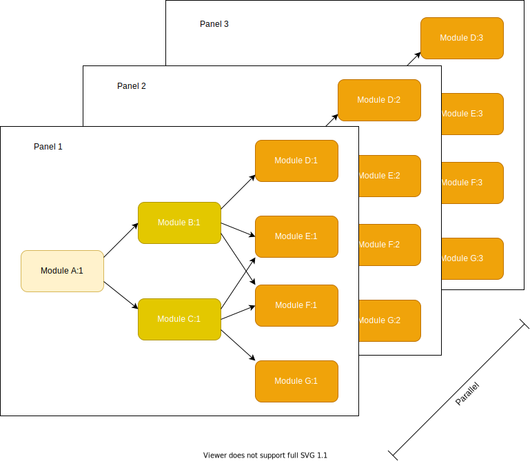
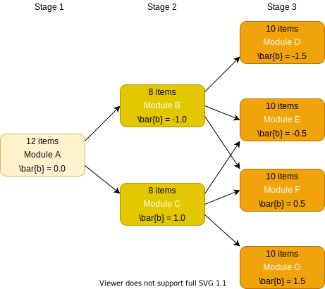
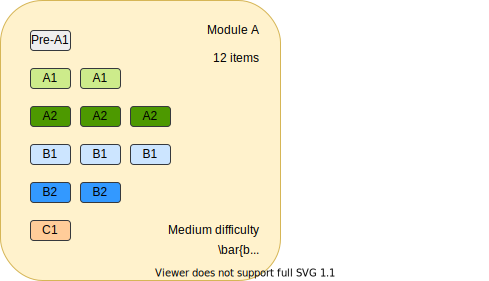

```{r setup, include=FALSE}
knitr::opts_chunk$set(echo = FALSE)
```

# Introduction and Overview

Computerised multistage tests (MSTs) have grown in popularity in recent years due to their advantages of flexibility and simplicity over linear and computerised adaptive tests (CATs). A growing body of academic literature is available for researchers, however the practicalities of using MST for the design and delivery of real-world tests is still difficult to access I hope this article provides a useful practical guide to test design and delivery.

The advantages of splitting tests up into units of items called *modules* and directing candidates to modules based on their latent ability scores, provides a more efficient (and shorter) test delivery than a corresponding linear test, while also offering an easier method of assembly, and greater protection against test copying.

I'll assume some familiarity with Item Response Theory (IRT) - and the Rasch model. Some knowledge of programming with R would be useful to understand the examples given. For background information and primers on these subjects I provide references.

My main focus is the development of tests for language learners, specifically English language learners. The theory and data processing involved can  be transferred to other domains that require measurement of latent ability. The IRT model that I focus on is the 1PL (or Rasch) model. For readers interested in extending analysis to more complex models, see [@magis2017computerized].

## Introduction to Item Response Theory

The underlying theoretical basis for MST is the branch of psychometrics known as Item Response Theory, or IRT. The theory proposes that there are *latent traits* (for example language ability) that can be measured using a set of tests delivered to the test candidate. These test items are typically scored as correct (1) or incorrect (0) - and it these dichotomous test types that we focus on here. The response to the test items can then be use to estimate the latent trait by fitting an IRT model.

### The Rasch Model

The simplest such model, the so-called *Rasch model*, relies on a single variable parameter, the difficulty parameter (usually designated as $b$). For this reason it is also known as the one-parameter logistic model (1PL). The *item response function* (IRF) for this model uses a logistic function to model the probability of a correct response for candidate $i$ taking test item $j$:

$$
Pr(X_{ij} = 1|\theta_{i},b_{j}) = \frac{exp(\theta_{i} - b_{j})}{1+exp(\theta_{i} - b_{j})}
$$

Here $X$ is the item response (either 1 or 0), $\theta$ represents the latent ability being measured, and $b$ represents the difficulty of the item. Certain assumptions are made by the model, most importantly:

* Each item targets one and only one latent trait
* The items are independent of one another
* The response probability increases with the ability level using a logistic cumulative distribution function

The sigmoid function can be seen below for three test items with different difficulties.


There is an equivalence between $\theta$ and $b$ such that a candidate with mean ability ($\theta = 0$) would be expected to get item US065_1 (green) correct with a probability of 0.28. The less difficult item US070_1 (black) would see a probability of around 0.95 for a correct response. Item US070_1 (red) is somewhere in between the two in terms of difficulty. You could also read this as stating that candidates who have a $\theta$ of 0.82 show a 50-50 chance of getting US065_1 correct. The difficulty parameter $b$ is set at this point, so we'd assign a difficulty of 0.82 to item US065_1 in our test. And assuming a normal distribution of candidates, items with difficulty 0 would expect to be answered correctly by 50% of candidates.

## IRT for Mulitstage Test Design

IRT is used to inform calibration of the test items after they've been developed by subject matter experts, as well as construction of the modules and routing between them. Scoring of the test can be derived from the $\theta$ estimates. Typically the initial module (known as the routing module) will have an overall difficulty of 0 (ie. a mix of easy and hard items), with subsequent routing directing candidates to easier or more difficult modules in order to 'hone in' on an accurate $\theta$ estimate at the end of the test.

A typical modular design can look like this:


This is an example of a 1-2-4 design, but others are possible. An important question to answer during test design, is the module topology and the overall difficulty level for each module (represented as the mean item difficulty, $\bar{b}$).

In the pre-trial stage, its possible to run simulations to help us answer these questions.

Its normal for a multistage test to have a single module in stage one, called the routing module. 

A benefit of using modules is that items can be placed into modules and then delivered as parallel test forms called panels. Having multiple panels helps to reduce item exposure rate as previously seen panels can be precluded from selection for future test administrations. It also makes it easier to assemble tests. It is possible to place items in more than one panel, but its important to ensure that parallel panels are of equivalent difficulty.



When constructed in this way each module can be considered as a module instance (for example Module A:3 being the instance of module A in panel 3),

## Data Sources and Management

In order to perform a simulated test, there are a number of different data sources that are required.

The first class of these data sources is the one that is used to store item information. The key entities to store here:

* Items
* Modules
* Panels

In addition to the item information, another data source is used for the candidate information. This forms the candidate information service that will be used for the test. In addition to storing a unique candidate ID, additional metadata of interest (such as the candidate's length of study or L1) may be held by the candidate information service.

Finally, test response data is required. Essentially this is a matrix containing rows of candidates and columns of items. Cells will conatain a 1 (item answered correctly) or a 0 (item answered incorrectly). Items that were not presented (for example, from a module that was not in the test path for a candidate) are left blank and will be classed as NAs.

This data may be stored as flat files (in CSV format for instance), or held in database tables, or in a mix of different sources. Typically you would want to stored them in a cloud storage system (for example in AWS S3 buckets or RDS databases) to ensure that the data is stored in a way that is secure, accessible and geographically distributed (for resilience).

## MST Design Considerations

I mentioned earlier that multi-stage test designs comprise a number of modules arranged into stages. The question then becomes, how many stages do I need, and how many modules in each stage? We saw earlier an example of a simple 1-2-4 design.

This design may not be sufficient for your needs. You need to consider whether there are groups of items that naturally fit into a particular stage (for example, seperating reading or listening tasks into seperate stages). You also need to consider how many items per stage you want to have. Also, in order for the routing between modules to produce acceptable results, you need to consider the relative difficulty of each module.

Normally the so-called routing module in stage 1 (Module A) would contain a mix of items with a mean difficulty of 0 (in other words 'medium' difficulty). Candidates that are placed in the lower ability range at the end of this module will be routed to the 'easy' module in stage 2 (Module B), and those in the upper ability range to the 'hard' module (Module C).

## Pre-Trial Simulation and Design

An initial simulation of your test to try out designs can be done by using the `mstR` library (see @magis2017computerized). Here the aim is to select a set of designs and see if there is an optimal design. It will also help understand how the scoring of the test should be implemented, including the number correct (NC) scores that will be used for routing, and the ability estimates for final scoring and reporting.

The `mstR` library can take an existing set of item responses, or you can use it to generate a set of randomised simulated item responses. This latter ability is useful in the pre-trial stage where we're interested in finding out how routing between modules should be established, or to validate assumptions in the test design.

The aim here is to sift several different test designs; and re-run simulations easily.

### Module Setup

With `mstR` we can define:

* the module topology (number of stages and modules per stage)
* the number of items per module and the module difficulty
* the IRT model to use

If we start out with the 1-2-4 design shown above, based on our test requirements, we can create a simultion for the test design with the following elements:

* a simulated item bank, `it.MST`
* the modules and the items they contain, `modules`
* the routing runes in the transition matrix `routing`



```{r module difficulties, echo=TRUE}
library(mstR)

it.MST <- rbind(genDichoMatrix(12, model = "1PL", bPrior = c("norm", 0.0, 1)),
	genDichoMatrix(8, model = "1PL", bPrior = c("norm", -1.0, 1)),
	genDichoMatrix(8, model = "1PL", bPrior = c("norm", 1.0, 1)),
	genDichoMatrix(10, model = "1PL", bPrior = c("norm", -1.5, 1)),
	genDichoMatrix(10, model = "1PL", bPrior = c("norm", -0.5, 1)),
	genDichoMatrix(10, model = "1PL", bPrior = c("norm", 0.5, 1)),
	genDichoMatrix(10, model = "1PL", bPrior = c("norm", 1.5, 1)))
it.MST <- as.matrix(it.MST)
```

Here we've decided to use the 1PL (or Rasch) model, so we need to supply `bPrior` difficulty distributions, and convert the data frame into a matrix. We'll end up with a matrix of 68 items, each with randomised difficulty parameters. A test will comprise 30 items (12 + 8 + 10).

Selecting items into the modules is done by creating another matrix with 68 rows (items) and 7 columns (modules); a cell containing a 1 indicates membership of an item in a module.

```{r module items, echo=TRUE}
modules <- matrix(0, 68, 7)
modules[1:12, 1] <- 1
modules[13:20, 2] <- 1
modules[21:28, 3] <- 1
modules[29:38, 4] <- 1
modules[39:48, 5] <- 1
modules[49:58, 6] <- 1
modules[59:68, 7] <- 1
```

The final part of the design activity is construction of the routing rules, which is done by creating an $R \times R$ *transition matrix* which shows the valid paths to modules in the next stage and where $R$ is the number of modules. A value of 1 indicates that a path exists from module $i$ to module $j$ in the matrix.

```{r module routing, echo=TRUE}
routing <- matrix(0, 7, 7)
routing[1, 2:3] <- 1
routing[2, 4:6] <- 1
routing[3, 5:7] <- 1

cutoff <- matrix(NA, 7, 2)
cutoff[2,] <- c(-Inf, 0.0)
cutoff[3,] <- c(0.0, Inf)
cutoff[4,] <- c(-Inf, -1.0)
cutoff[5,] <- c(-1.0, 0.0)
cutoff[6,] <- c(0.0, 1.0)
cutoff[7,] <- c(1.0, Inf)

(cutoff)
```

As can be seen, modules 4-7 (Module D to Module G in the design) are final stage modules, so do not route onward.

Having created a simulated item bank for the design, it is possible to generate simulated item responses by selecting a $\theta$ for a simulated candidate:

```{r simulated test response, echo=TRUE}
theta <- 0.95

dfSampleResponse <- genPattern(theta, it.MST)

(dfSampleResponse)
```

Here we use a $\theta$ of `r theta`. Note that this doesn't really simulate a true MST test, as it ignores the routing rules and simply returns a response for all items in the simulated item bank. We can however use the `randomMST()` function to perform a more realistic simulation. The `randomMST()` function will generate a response pattern for a given simulated item bank, an MST structure, and a true ability level ($\theta$). We'll use maximum likelihood estimation (`"ML"`) for ability estimation, and the maximum Fisher information criterion (`"MFI"`) for module selection.

```{r simulated MST test response, echo=TRUE}
start <- list(theta = theta)
test <- list(method = "ML", moduleSelect = "MFI")
final <- list(method = "ML")

dfMSTResponse <- randomMST(trueTheta = theta, 
                           itemBank = it.MST, modules = modules, transMatrix = routing,
                           start = start, test = test, final = final)

(dfMSTResponse)
```

The Module Information Function is used to determine the 'best' (ie. the most informative) module to route to in the next stage. In this example the selected modules are `r dfMSTResponse$selected.modules`. A plot can be made as follows, showing the highlighted route through the multi-stage test:

```{r show simulated test, echo=FALSE}
plot(dfMSTResponse)
```

### Running Repeated Simulations

We can run repeated simulations varying the topology of the test (for example changing the 1-2-4 design presented earlier). Or by changing the number of items per module, the mean difficulty levels, or some other aspect of the model. By calculating the differences between estimated and true ability levels we can see which set of parameters is optimal.

In this example we'll change the number of items per module; keeping the total number constant, but changing the relative number of items as follows:

| Design | Stage 1 | Stage 2 | Stage 3 | Total |
| ------ | ------: | ------: | ------: | ----: |
| 1      | 12      | 8       | 10      | 30    |
| 2      | 12      | 10      | 8       | 30    |
| 3      | 10      | 12      | 8       | 30    |
| 4      | 10      | 8       | 12      | 30    |
| 5      | 8       | 10      | 12      | 30    |
| 6      | 8       | 12      | 10      | 30    |

The `mstDesign()` function is used to generate the set of test designs, by varying the number of items for each module by stage.

```{r MST designs}
mstDesign <- function(stage, difficulties) {
  matrixN <- stage[1] + (2 * stage[2]) + (4 * stage[3])
  modules <- matrix(0, matrixN, 7)
  moduleA <- stage[1]
  moduleB <- moduleA+stage[2]
  moduleC <- moduleB+stage[2]
  moduleD <- moduleC+stage[3]
  moduleE <- moduleD+stage[3]
  moduleF <- moduleE+stage[3]
  moduleG <- moduleF+stage[3]
  
  modules[1:moduleA, 1] <- 1
  modules[moduleA+1:stage[2], 2] <- 1
  modules[moduleB+1:stage[2], 3] <- 1
  modules[moduleC+1:stage[3], 4] <- 1  
  modules[moduleD+1:stage[3], 5] <- 1
  modules[moduleE+1:stage[3], 6] <- 1
  modules[moduleF+1:stage[3], 7] <- 1
  
  itembank <- rbind(genDichoMatrix(stage[1], model = "1PL", bPrior = c("norm", 0.0, 1)),
                    genDichoMatrix(stage[2], model = "1PL", bPrior = c("norm", -1.0, 1)),
                    genDichoMatrix(stage[2], model = "1PL", bPrior = c("norm", 1.0, 1)),
                    genDichoMatrix(stage[3], model = "1PL", bPrior = c("norm", -1.5, 1)),
                    genDichoMatrix(stage[3], model = "1PL", bPrior = c("norm", -0.5, 1)),
                    genDichoMatrix(stage[3], model = "1PL", bPrior = c("norm", 0.5, 1)),
                    genDichoMatrix(stage[3], model = "1PL", bPrior = c("norm", 1.5, 1)))
  itembank <- as.matrix(itembank)

  return(list("modules" = modules, "itemBank" = itembank))
}

stages <- list(c(12,8,10), c(12,10,8), c(10,12,8),
               c(10,8,12), c(8,10,12), c(8,12,10))
testDesigns <- lapply(stages, mstDesign)
```

To run the simulations we'll create a set of 8,550 simulated candidates with ability range -2.5 to 2.5 (stepped in increments of 0.25). Then we'll repeat for each of the six designs above, with the same item bank.

```{r setup simulation}
simulation.levels <- seq(-2.5, 2.0, 0.25) # 19 ability levels
simulation.candidates <- rep(simulation.levels, each = 450) # 19 * 450 = 8550 simulated candidates
simulation.responses <- matrix(NA, length(simulation.candidates), 6)
simulation.start <- list(theta = 0)
simulation.test <- list(method = "ML", moduleSelect = "MFI")
simulation.final <- list(method = "ML")
```

We'll then loop over each design, running the `randomMST()` function to simulate a test.

```{r simulate tests}
for (j in 1:6) {
  for (i in 1:length(simulation.candidates)) {
    prov <- randomMST(trueTheta = simulation.candidates[i],
      itemBank = testDesigns[[j]]$itemBank, modules = testDesigns[[j]]$modules,
      transMatrix = routing, genSeed = i,
      start = simulation.start, test = simulation.test, final = simulation.final)
    simulation.responses[i,j] <- prov$thFinal
  }
}
```

#### ASB and RMSE values

The results can now be graphed, with averaged signed bias (ASB) and root mean squared error (RMSE) values calculated for each design and for each ability level. ASB is the mean difference between estimated and true ability levels, and RMSE is the square root of the mean of the squared differences between estimated and true ability levels. With both measures, lower is better.

```{r simulation results}
simulation.ASB <- simulation.RMSE <- matrix(NA, length(simulation.levels), 6)
ASB <- function(t, th) mean(t-th)
RMSE <- function(t, th) sqrt(mean((t-th)^2))

for (i in 1:length(simulation.levels)) {
  for (j in 1:6) {
    index <- which(simulation.candidates == simulation.levels[i])
    simulation.ASB[i,j] <- ASB(simulation.responses[index,j], simulation.candidates[i])
    simulation.RMSE[i,j] <- RMSE(simulation.responses[index,j], simulation.candidates[i])
  }
}

dfASB <- data.frame(simulation.ASB)
dfASB$theta <- simulation.levels

dfRMSE <- data.frame(simulation.RMSE)
dfRMSE$theta <- simulation.levels
```

```{r simultation graphs}
cbPalette <- c("#999999", "#E69F00", "#56B4E9", "#009E73", "#F0E442", "#0072B2", "#D55E00")

ggplot(data = dfASB, aes(x = theta)) +
  scale_y_continuous(limits = c(-1, 5)) +
  geom_line(aes(y = X1, colour=cbPalette[1])) + 
  geom_line(aes(y = X2, colour=cbPalette[2])) +
  geom_line(aes(y = X3, colour=cbPalette[3])) +
  geom_line(aes(y = X4, colour=cbPalette[4])) +
  geom_line(aes(y = X5, colour=cbPalette[5])) +
  geom_line(aes(y = X6, colour=cbPalette[6])) +
  labs(x = "theta", y = "ASB")

ggplot(data = dfRMSE, aes(x = theta)) +
  scale_y_continuous(limits = c(-1, 5)) +
  geom_line(aes(y = X1, colour=cbPalette[1])) + 
  geom_line(aes(y = X2, colour=cbPalette[2])) +
  geom_line(aes(y = X3, colour=cbPalette[3])) +
  geom_line(aes(y = X4, colour=cbPalette[4])) +
  geom_line(aes(y = X5, colour=cbPalette[5])) +
  geom_line(aes(y = X6, colour=cbPalette[6])) +
  labs(x = "theta", y = "RMSE")
```


See chapter 7 of [@magis2017computerized] for details, or check out the [CRAN page](https://cran.r-project.org/web/packages/mstR/index.html) for `mstR`.


## Trialling and Test Validation

Once the parameters of the test design are well established, the test designers should have a good idea of the number of modules, items and relative difficulties required. 

### Item Writing and Intial Validation

A process of item writing will then be undertaken. Subject matter experts (SMEs) will be brought in to help define the instructions of test writers, and a set of items will then be created by the team of item writers. To take our test design example, we'll establish the number of items for each module that will be required at each CEFR level.

In general the test designers will want to ensure that each module contains a balance of items of varying difficulty. The Common European Frame of Reference (CEFR) is used to assign items into different ability levels.


A group of raters will be used to validate items and ensure that they are set at the correct ability level. Rating sheets are then collated and a decision then made on the CEFR ability rating for each item in the item bank. Various methods can be used to converge on an agreed ability level for each item; the simplest is to find the modal ability level (ie. the most frequently occurring) from all your raters. Where there is no single mode, or there are wide diagreements between raters, a manual adjustment to a commonly agreed ability level may be required. Ideally at least 5 raters would be used for each item to avoid this as far as possible.

Once ability levels are agreed, they should be used to update the item bank.


### Initial Trial

The purpose of the initial trial is to administer a test to a cohort of test candidates. Care should be taken to ensure that this cohort is representative of the target candidature. The test response can then be used to calculate item difficulties using the selected IRT model. We'll use the 1PL (Rasch) model in the examples that follow. 

#### Import and validation of trial data

The trial data is usually received as CSV or Excel files that comprise a candidate ID and then a set of responses (0 or 1) for each item. Not all items may have been taken by each candidate so there is a good chance of NA values occurring. Data validation and cleansing is a key part of preparing the data from the field trial so that it can be used in a Rasch analysis.

```{r}
library(tidyverse)

dfTestResponses <- read_csv('trial-data.csv')

head(dfTestResponses[1:8])
```

The `ltm` library can be used to fit a number of dichotomous and polytomous IRT models. Its the fastest library that I've found for fitting a Rasch model. Before doing that we get some summary statistics from the data, including the Cronbach's alpha measure of covariance. 

#### Consistency and reliability

We want to make sure that our modules are internally consistent and reliable as tests of a given ability. In our test we've grouped various skills or abilities into the various stages. So, stage 1 (ie. Module A) is designed as a test of language use, stage 2 (Modules B and C) is designed to measure reading skills, and stage 3 is designed to measure listening skills. The overall test is designed to measure English language ability in non-native learners of English.

Cronbach's alpha is a function of the number of items in a test, the average covariance between pairs of items, and the variance of the total score. It is defined as:

$$
\alpha = \frac{p \times \bar{r}}{1 + (p – 1)\bar{r}}
$$

Here, $p$ is the number if items and $\bar{r}$ is the average of all covariances between items.

In our test we've split our items into different modules according to the skill that is being measured, so it makes sense to calculate alphas for each module, although we could also do so by stage if we wanted. We need to make sure that we remove any rows containing NA values before calculating Cronbach's alpha.

```{r Cronbach alpha}
library(ltm)
library(ggrepel)

# drop the Candidate column, it's not required for the IRT functions
dfTrial <- dplyr::select(dfTestResponses, -Candidate)

# now create per-module item response data frames, remembering to remove 
# any candidates who did not take the module
dfModuleAItems <- dfTrial %>% dplyr::select(1:12) %>% na.omit()
dfModuleBItems <- dfTrial %>% dplyr::select(13:20) %>% na.omit()
dfModuleCItems <- dfTrial %>% dplyr::select(21:28) %>% na.omit()
dfModuleDItems <- dfTrial %>% dplyr::select(29:38) %>% na.omit()
dfModuleEItems <- dfTrial %>% dplyr::select(39:48) %>% na.omit()
dfModuleFItems <- dfTrial %>% dplyr::select(49:58) %>% na.omit()
dfModuleGItems <- dfTrial %>% dplyr::select(59:68) %>% na.omit()

# calculate Cronbach's alpha for each module
alphasModuleA <- ltm::cronbach.alpha(dfModuleAItems, standardized = TRUE, na.rm = TRUE)
alphasModuleB <- ltm::cronbach.alpha(dfModuleBItems, standardized = TRUE, na.rm = TRUE)
alphasModuleC <- ltm::cronbach.alpha(dfModuleCItems, standardized = TRUE, na.rm = TRUE)
alphasModuleD <- ltm::cronbach.alpha(dfModuleDItems, standardized = TRUE, na.rm = TRUE)
alphasModuleE <- ltm::cronbach.alpha(dfModuleEItems, standardized = TRUE, na.rm = TRUE)
alphasModuleF <- ltm::cronbach.alpha(dfModuleFItems, standardized = TRUE, na.rm = TRUE)
alphasModuleG <- ltm::cronbach.alpha(dfModuleGItems, standardized = TRUE, na.rm = TRUE)

# create a composite data frame and plot the alphas and the number of samples
# we'll want to focus on modules that show a low alpha and a small number of samples
# as we may want to get more trial data for these, or look at the items to make
# sure they are testing the right skill (or both)
module <- c('A', 'B', 'C', 'D', 'E', 'F', 'G')
stage <- c(1, 2, 2, 3, 3, 3, 3)
alpha <- c(alphasModuleA$alpha, alphasModuleB$alpha, alphasModuleC$alpha,
            alphasModuleD$alpha, alphasModuleE$alpha, alphasModuleF$alpha,
            alphasModuleG$alpha)
num_items <- c(alphasModuleA$p, alphasModuleB$p, alphasModuleC$p,
            alphasModuleD$p, alphasModuleE$p, alphasModuleF$p,
            alphasModuleG$p)
num_responses <- c(alphasModuleA$n, alphasModuleB$n, alphasModuleC$n,
            alphasModuleD$n, alphasModuleE$n, alphasModuleF$n,
            alphasModuleG$n)

dfCronbachsAlpha <- data.frame(module, stage, num_items, num_responses, alpha)

(dfCronbachsAlpha)

ggplot(dfCronbachsAlpha, aes(x=alpha, y=num_responses, size = num_items, color = module)) +
    geom_point() +
    geom_label_repel(aes(label = module, size = NULL)) +
    scale_x_continuous(limits = c(0, 1)) +
    theme(legend.position = "none") +
    labs(x = "alpha", y = "# responses") +
    geom_vline(xintercept = 0.7)
```
Ideally we're looking for alphas of 0.7 and above; less than this indicates that there is weak covariance between the items in the module, which means they may not be testing the same ability. This measure is really only useful as a guide for further investigations; the ultimate decision on whether to modify the items in each module should be taken in collaboration with the raters and other subject matter experts.

```{r Rasch model}
# fit the Rasch model
raschmodel <- ltm::rasch(dfTrial, constraint = cbind(length(dfTrial) + 1, 1),
                     IRT.param = TRUE, start.val = "random")
rasch_summary <- summary(raschmodel)
```


	- Updating the item bank
	- Other outputs

7. Summary

8. Bibliography


