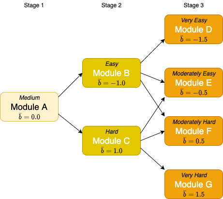

```{r setup, include=FALSE}
knitr::opts_chunk$set(echo = FALSE)
```

# Introduction and Overview
Computerised multistage tests (MSTs) have grown in popularity in recent years due to their advantages of flexibility and simplicity over linear and computerised adaptive tests (CATs). A growing body of academic literature is available for researchers, but the practicalities of using MST for design and delivery of real-world tests is still difficult to find. I hope this article provides a useful guide to the practical work of test creation and delivery.

The advantages of splitting tests up into units of items called *modules* and directing candidates to modules based on their latent ability scores, provides a more efficient (and shorter) test delivery than a corresponding linear test, while also offering an easier method of assembly, and greater protection against test copying.

I'll assume some familiarity with

 IRT or Item Response Theory (at least with Rasch analysis), although I provide a brief summary below. Also some competence with R programming would be useful to understand the examples given. For background information and primers on these subjects I provide references.

My main focus is the development of tests for language learners, specifically English language learners. The theory and data processing involved can easily be transferred to other domains that require measurement of latent ability. The IRT model that I focus on is the 1PL (or Rasch) model. For readers interested in extending analysis to more complex models, see [@magis2017computerized].

## Introduction to Item Response Theory
The underlying theoretical basis for MST is the branch of psychometrics known as Item Response Theory, or IRT. The theory proposes that there are *latent traits* (for example language ability) that can be measured using a set of tests delivered to the test candidate. These test items are typically scored as correct (1) or incorrect (0) - and it these dichotomous test types that we focus on here. The response to the test items can then be use to estimate the latent trait by fitting an IRT model.

### The Rasch Model
The simplest such model, the so-called *Rasch model*, relies on a single variable parameter, the difficulty parameter (usually designated as $b$). For this reason it is also known as the one-parameter logistic model (1PL). The *item response function* (IRF) for this model uses a logistic function to model the probability of a correct response for candidate $i$ taking test item $j$:

$$
Pr(X_{ij} = 1|\theta_{i},b_{j}) = \frac{exp(\theta_{i} - b_{j})}{1+exp(\theta_{i} - b_{j})}
$$
Here $X$ is the item response (either 1 or 0), $\theta$ represents the latent ability being measured, and $b$ represents the difficulty of the item. Certain assumptions are made by the model, most importantly:

* Each item targets one and only one latent trait
* The items are independent of one another
* The response probability increases with the ability level using a logistic cumulative distribution function

This S-shaped function can be seen below for three test items with different difficulties.


There is an equivalence between $\theta$ and $b$ such that a candidate with mean ability ($\theta = 0$) would be expected to get item US065_1 (green) correct with a probability of 0.28. The less difficult item US070_1 (black) would see a probability of around 0.95 for a correct response. Item US070_1 (red) is somewhere in between the two in terms of difficulty. You could also read this as stating that candidates who have a $\theta$ of 0.82 show a 50-50 chance of getting US065_1 correct. The difficulty parameter $b$ is set at this point, so we'd assign a difficulty of 0.82 to item US065_1 in our test. And assuming a normal distribution of candidates, items with difficulty 0 would expect to be answered correctly by 50% of candidates.

## IRT for Mulitstage Test Design
IRT is used to inform calibration of the test items after they've been developed by subject matter experts, as well as construction of the modules and routing between them. Scoring of the test can be derived from the $\theta$ estimates. Typically the initial module (known as the routing module) will have an overall difficulty of 0 (ie. a mix of easy and hard items), with subsequent routing directing candidates to easier or more difficult modules in order to 'hone in' on an accurate $\theta$ estimate at the end of the test.

A typical modular design can look like this:



## Extra Background Info?
Item-banking
Assembly
Estimation
Scoring
Linking
Equating

## Data Sources and Management

In order to perform a simulated test, there are a number of different data sources that are required. 

The first class of these data sources is the one that is used to store item information. The key entities to store here:

* Items
* Modules
* Panels

Items are aggregated into Modules, and Modules are grouped into Panels. A Panel is a set of Modules that can be delivered as a test instance. Note that it is possible for Items to be placed in more than one Panel (although an Item should not be duplicated in the same Panel).

In addition to the item information, another data source is used for the candidate information. This forms the candidate information service that will be used for the test. In addition to storing a unique candidate ID, additional metadata of interest (such as the candidate's length of study or L1) may be held by the candidate information service.

Finally, test response data is required. Essentially this is a matrix containing rows of candidates and columns of items. Cells will conatain a 1 (item answered correctly) or a 0 (item answered incorrectly). Items that were not presented (for example, from a module that was not in the test path for a candidate) are left blank and will be classed as NAs.

This data may be stored as flat files (in CSV format for instance), or held in database tables, or in a mix of different sources. Typically you would want to stored them in a cloud storage system (for example in AWS S3 buckets or AWS RDS datbases) to ensure that the data is stored in a way that is secure, accessible and geographically distributed (for resilience).

## MST Design Considerations?
	- Terminology
	- Benefits
	- Design

## Initial Simulation

	- Design test and validation

6. Trialling and Test Validation
	- Item Writing and Intial Validation
	- Trialling
	- Import and validation of trial data
	- Updating the item bank
	- Other outputs

7. Summary

8. Bibliography


